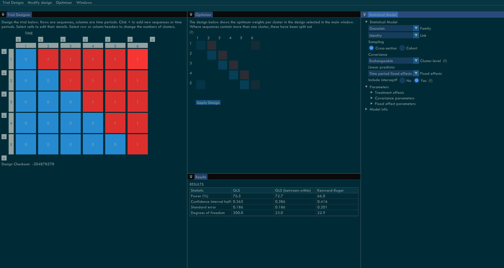
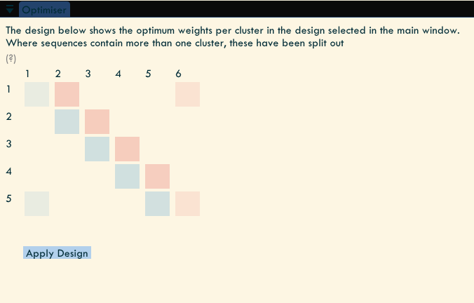
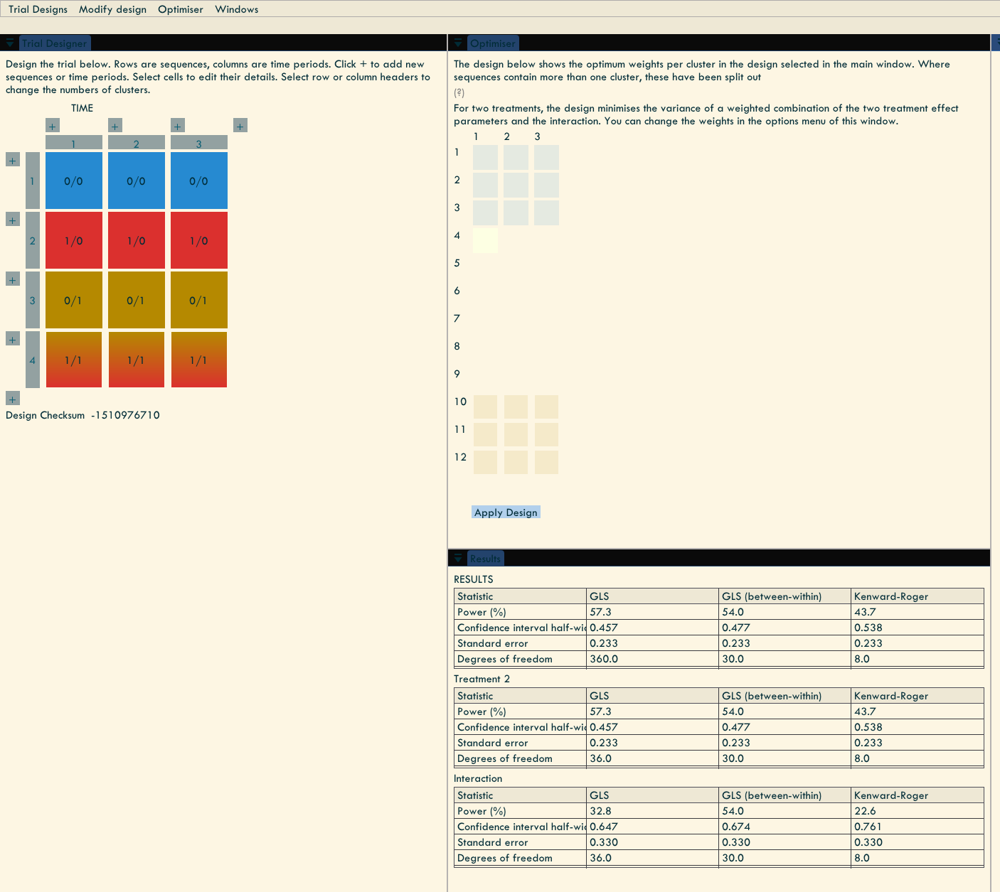

# ClusterApp
An application for design analysis for cluster randomised trials. The application provides an interactive graphical user interface to design a cluster trial, set model parameters, identify optimal designs, and determine power. A wide range of models are provided for both fixed and random effects, including exchangeable, nested exchangeable, and exponential decay covariance models at cluster and individual levels; Gaussian, binomial, poisson, beta, and gamma models with a range of link functions; and, time fixed effects and cluster time trends. Power, confidence intervals, and standard errors are calculated using GLS covariance and with between-within and [Kenward-Roger](https://doi.org/10.2307/2533558) corrections. Optimal design weights are calculated using the ["Girling" algorithm](https://doi.org/10.2307/2533558). The app also include two treatment designs including factorial trials.

The app is available online at [clustertrial.app](https://www.clustertrial.app/).

## Using the app



The windows can be moved around and docked using the dockspace as shown in the image above. Click and drag via the title bar of each window to use the dockspace. The dockspace can also be disabled in Windows->Dockspace. The Windows menu can be used to show/hide the different windows. 

The designer window (left windown in the screenshot) has several ways of interacting with it. You can click individual cluster/sequence-periods to modify its active and treatment statuses, as well as its number of observations. Clicking the row or column headers will allow control over all cluster/sequence-periods in that column or row and provides the option to delete columns and rows. The + symbols allow you to add rows and columns. The menu Trial Designs provide a range of pre-specified trial designs with various options and Modify Design provides several ways of editing all the cluster/sequence-periods in the design. The Statistical Model window (right window in the screenshow) provides all the controls for editing the model and is where the parameter values, including the treatment effect can be modified. The results and optimal design windows update automatically; a check is performed once a second for any changes and if any are detected then the calculations will be updated automatically. The optimal design window (middle top) shows the optimal design weights for each cluster-period; clicking on the cells in this design will show the weights and a total number of observations using Hamilton's rounding method. The `Apply design` button, will apply the optimal design to the trial designer window. Finally, the results window (middle bottom) shows the power, confidence interval width, and other information. 



To enable factorial designs and other designs with two treatments select Trial designs->Two treatments. When there are two treatments, the model will include the individual treatment indicators and their interaction. Cells with the second treatment are coloured yellow, and the interaction are both red/yellow. The results window will show results for both treatments and the interaction, as below. In addition, there are also options for dose response designs with a linear treatment effect and heterogeneous treatment effects including treatment indicator random effects.



# Other features
There are a range of other features that can be accessed through the menu View->Windows. These include: optimal design weights, sample minimization, sample size summaries, and plotting functions. 

# Future features
The application is still in development stage and may have bugs. For upcoming versions we plan to implement the following features:

- Heterogeneous treatment effects including random effect treatment terms and treatment by time interactions.
- Cluster-specific linear and polynomial time trends.
- Continuous time models including continuous enrollment.
- Combinatorial optimisation algorithms (with animation!).
- Exporting of trial design diagrams.
- Restricted randomisation methods and model adjustment.
- (More distant future) Bayesian trial design analysis including statistics like average posterior variance.

# Software
The underlying GLMM library is our own `glmmr` library, which is also provided as an [R package](https://samuel-watson.github.io/glmmr-web/), which is available on CRAN as [glmmrBase](https://cran.rstudio.com/web/packages/glmmrBase/index.html) and [glmmrOptim](https://cran.rstudio.com/web/packages/glmmrOptim/index.html). The [glmmr website](https://samuel-watson.github.io/glmmr-web/) provides tutorials and examples of using the R package. The folder `src/glmmr` contains all the header files and can be ported to other projects. The GUI is built using [Dear ImGui](https://github.com/ocornut/imgui).

## Compilation
The application is built using [Emscripten](https://emscripten.org/), which compiles C/C++ code to WebAssembly. The project also requires the libraries [Eigen](https://eigen.tuxfamily.org/index.php?title=Main_Page) and [Boost](https://www.boost.org/). These are header only librarys, along with ImGui. To build the project change `IMGUI_DIR`, `EIGEN_DIR`, and `BOOST_DIR` in the makefile to the relevant paths for the respective libraries. Then the application can be built using
```
emmake make
```
on Linux/MacOS or
```
emmake mingw32-make
```
on Windows systems, assuming MinGW is the compiler. Similarly, the project can be built as a standalone application.

# References and useful links

- See [Watson & Pan (2023)](https://doi.org/10.1007/s11222-023-10280-w) for more information on rounding methods, and c-optimal designs using GLMMs using combinatorial optimisation algorithms.
- [Watson, Hemming, and Girling (2023)](https://arxiv.org/abs/2303.07953) provides an overview of optimal cluster trial designs and methods.

